<p align="center">
  
</p>

<p align="center">
  <strong>Browser game built for Pride Game Jam 2026 — colorful, inclusive, and playable from a link.</strong>
</p>

<p align="center">
  <a href="https://dacameragirl.github.io/pride-game-jam-2026/"></a>
  <a href="https://github.com/DaCameraGirl/pride-game-jam-2026"></a>
</p>

<p align="center">
  
  
</p>

### Languages

<p align="center">
  
  
  
</p>

### Stack

<p align="center">
  
  
</p>

<p align="center">
  Built by <strong>Angela Hudson</strong> · <a href="https://github.com/DaCameraGirl">DaCameraGirl</a>
</p>
<div align="center">

| ❤️ | 🧡 | 💛 | 💚 | 💙 | 💜 |
|---|---|---|---|---|---|
| Catch | Build | Match | Play | Learn | Shine |

</div>

<p align="center"></p>
<p align="center"></p>


**Prism Playgrounds** is a family-friendly Pride-themed browser game collection. It works like a tiny arcade hub: pick a mini-game, play a short round, and jump into another activity whenever you want.

The goal is colorful, welcoming, easy-to-run fun. Pride colors are part of the actual play, not just decoration.

<p align="center"></p>
<p align="center"></p>


| Game | What You Do | Vibe |
|---|---|---|
| 🌈 **Parade Catch** | Move the parade cart, catch prism pieces, and keep the color meter bright. | Arcade |
| 🏳️‍⚧️ **Flag Builder** | Complete Pride flag color patterns from top stripe to bottom stripe. | Puzzle |
| 💖 **Kindness Match** | Flip cards and match positive values. | Memory |

<p align="center"></p>
<p align="center"></p>


| Action | Controls |
|---|---|
| Move in Parade Catch | `Arrow Left` / `Arrow Right` or `A` / `D` |
| Use pulse in Parade Catch | `Space` |
| Start or switch games | Mouse, touch, or `Enter` |

<p align="center"></p>
<p align="center"></p>


Open `index.html` in a modern browser.

Or run a small local server:

```bash
python -m http.server 8000
```

Then open:

```text
http://localhost:8000
```

<p align="center"></p>
<p align="center"></p>


| File | Purpose |
|---|---|
| `index.html` | Page structure and game shell |
| `styles.css` | Pride-themed visual design and responsive layout |
| `game.js` | Mini-game logic and interactions |
| `Pride Game Jam 2026.txt` | Short local project note |

<p align="center"></p>
<p align="center"></p>


- Keep the tone kid-friendly, bright, and welcoming.
- Make a real playable game collection, not just a themed page.
- Use Pride colors clearly and respectfully throughout the experience.
- Stay dependency-free so the game is easy to host on GitHub Pages.

<p align="center"></p>
<p align="center"></p>


Made by **Angela Hudson / DaCameraGirl** for **Pride Game Jam 2026**.